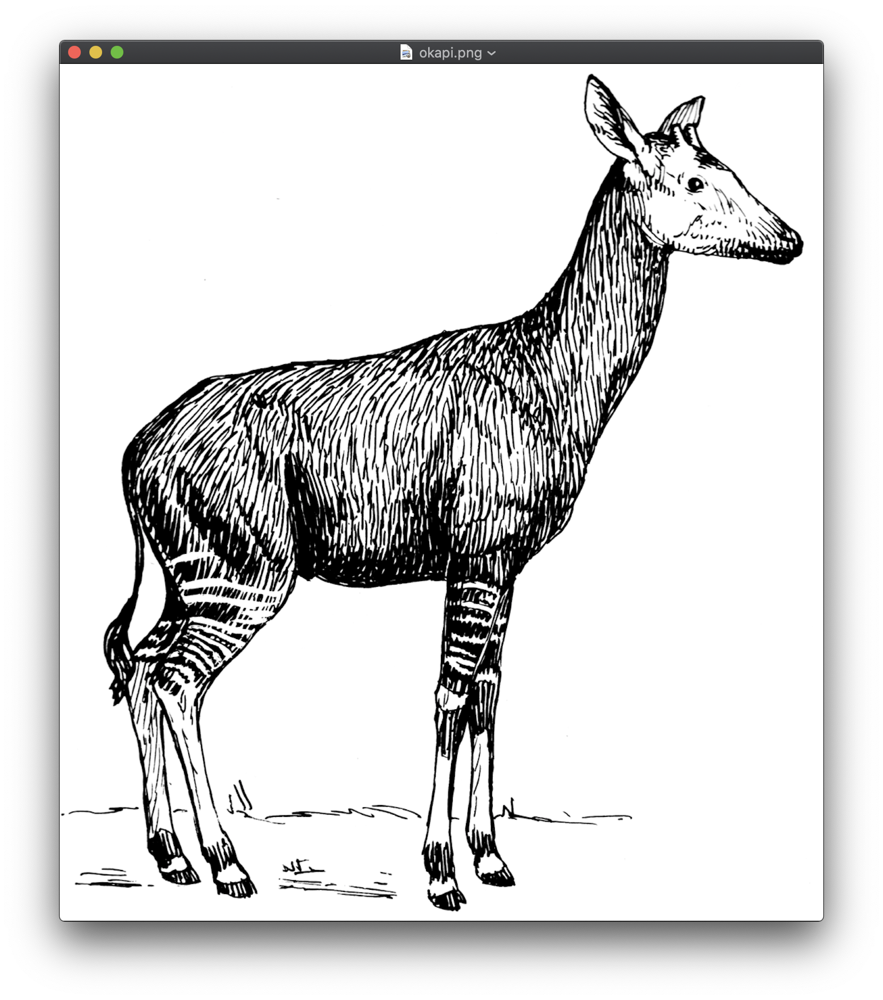

# okapi


_noun, plural **o·ka·pis**, (especially collectively) **o·ka·pi**_

1. An African mammal, _Okapia johnstoni_, closely related to and resembling the giraffe, but smaller and with a much shorter neck.
1. A small framework for (OK) composable API clients.

### Features

- Transparent error handling
- Flexible encoding / decoding
- Configurable, with sensible defaults
- Adheres to standard "net/http" interfaces 

### Examples

The Okapi client was desinged to be wrapped inside various helper structs, though it still can be used without any additional structs or fields.

``` go
type films struct {
    client *okapi.Client
}

func Films(client *okapi.Client) *films {
    return &films{client}
}

func (c *films) Get(name string) (*FilmsResponse, error) {
    var res FilmsResponse

    opts := &okapi.QueryOptions{
        Params: map[string]string{
            "search": name,
        },
        Out: &res,
    }

    if _, err := c.client.Get("/api/films/", opts); err != nil {
        return nil, err
    }
    return &res, nil
}

```

Using the client:

``` go
func main() {
    client, _ := okapi.NewClient(&okapi.Config{
        Address: BASE_URL,
    })

    res, _ := Films(client).Get("Dune")
}
```

For a complete example implementation, see [examples/starwars](examples/starwars/)

### License

Okapi is available under the terms of the MIT License.
